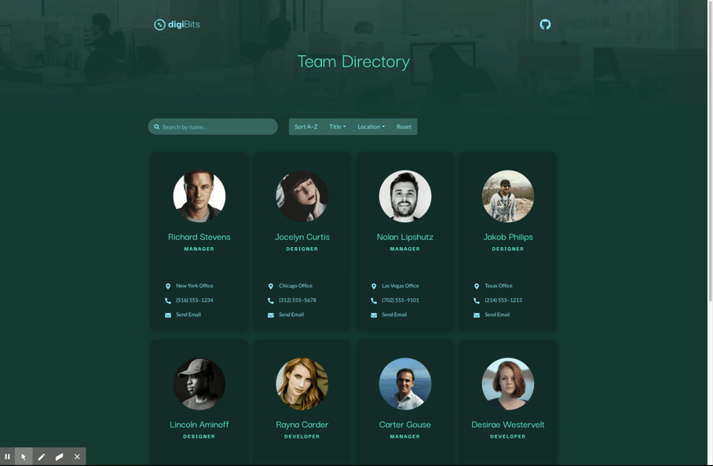
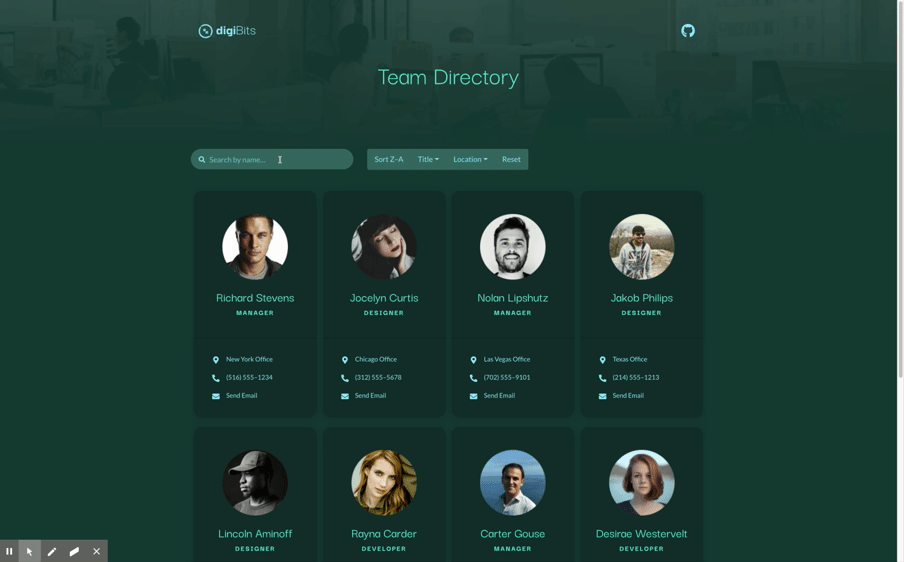
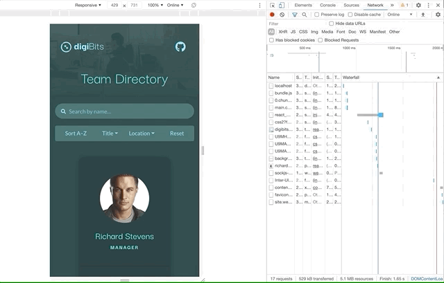

# unit-19-react-homework-employee-directory

> ### [Visit Deployed Site](https://unit-19-react-homework-employee-directory.netlify.app)

## Objective 
Build an employee directory webpage from scratch using React. 

## Project Details

* Features a custom logo and color scheme that I designed for this project. 

* Colors pass WCAG AAA Level Contrast Ratio standard for color.

* A design mockup was initially created in [Figma prototype](https://www.figma.com/file/RTXniEKvVTicGOcdrVikDd/unit-19-react-homework-employee-directory?node-id=60%3A5) which allowed for rapid experimentation and content creation before jumping into code.

* Employee details are all dynamically mapped from a JSON file. 

    * Employee locations are uniquely linked to Google Maps for NYC, Chicago, Las Vegas and Texas. 

    * Employee phone numbers are able to trigger an actual phone call. (Numbers are factitious) 

    * Email link do all link to unique email addresses, based on the employee's name. (Emails are factitious) 

* React project uses `react-bootstrap`, custom css and `Flexbox` to address styling and make responsive.  

* Used `rel="noopener noreferrer"` on `<a>` elements to protect against `target="_blank"` allowing outside pages access to the `window.opener` object. 

* `useState` and `useEffect` hooks are used to control search and filtering functionality. 

* Search features multiple kinds of validation 

    * All input values are converted to lowercase, so that it matches the JSON name value. 

    * If the input value is a special character or number, a warning message is provided and the input does not go through. Instead all the team members are reloaded. 

    * If the search result does not match a name or the user filters down to no more team memebers, a helper message appears telling them to hit "Reset" and/or try a different name.

* Reset button clears out search field and displays the original team cards.

* Sorting button puts the team members in alphabetical and reverse alphabetical order, based on name. 
    
    * Text in the button changes based on the sorting method selected. 

* Dropdowns filter team members by their titles or by their location

* Team images **lazy load** in

---

## Demos

#### Responsive Design

#### Search By Name

#### Search Validation

#### Filter Names in Alphabetical order / Title / Location / Reset 

#### Lazy Load For Team Images 

